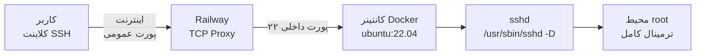

<div align="center">

# 🐧 Ubuntu SSH Server — Railway Edition

### سرور اوبونتو روی Railway با دسترسی کامل SSH — بدون GUI

<p>
  
  
  
  
  
</p>

<p>
  <a href="https://github.com/hajihshmat/docker-ubuntu-free">
    
  </a>
  <a href="https://railway.app">
    
  </a>
</p>

</div>

---

> ## ⚠️ هشدار امنیتی — این بخش را قبل از هر چیز بخوانید
>
> رمز عبور پیش‌فرض کاربر `root` به‌صورت **متن ساده** داخل فایل `entrypoint.sh` نوشته شده است و در همین مخزن عمومی قابل مشاهده است. یعنی هر کسی که این مخزن را ببیند، می‌تواند به سرور در حال اجرای شما وصل شود.
>
> **بعد از اولین ورود، بلافاصله رمز عبور را تغییر دهید:**
>
> ```bash
> passwd root
> ```
>
> و یک رمز قوی و یکتا انتخاب کنید. تا زمانی که این کار را نکرده‌اید، سرور شما در معرض خطر است.
>
> برای تغییر دائمی رمز (که بعد از هر Deploy باقی بماند) بخش [تغییر رمز عبور](#-تغییر-رمز-عبور-مهم) را ببینید.

---

## 📖 معرفی پروژه

این پروژه یک **سرور اوبونتو با دسترسی کامل SSH** روی پلتفرم [Railway](https://railway.app) راه‌اندازی می‌کند. کافی است مخزن را Fork کنید و روی Railway مستقر کنید — در چند دقیقه یک سرور لینوکس واقعی با دسترسی root در اختیار دارید.

برخلاف نسخه‌های مشابه، این پروژه **هیچ محیط گرافیکی (GUI) ندارد** و عمداً سبک نگه داشته شده است: فقط `openssh-server` و چند ابزار ضروری. در نتیجه سریع Build می‌شود، منابع کمتری مصرف می‌کند و روی پلن رایگان Railway راحت اجرا می‌شود.

### این پروژه چه چیزی هست و چه چیزی نیست

| ✅ هست | ❌ نیست |
|:---|:---|
| سرور Ubuntu 22.04 با دسترسی root | دسکتاپ گرافیکی یا محیط XFCE |
| دسترسی SSH از طریق ترمینال | دسترسی VNC یا noVNC از مرورگر |
| محیط CLI کامل با `git`, `vim`, `curl`, `wget` | محیط کاربری گرافیکی برای کارهای تصویری |
| مناسب اجرای اسکریپت، بیلد، آموزش لینوکس | جایگزین سرور Production |

---

## 🙏 اعتبار و منبع الهام

این پروژه از مخزن [**technamooz/docker-ubuntu-free**](https://github.com/technamooz/docker-ubuntu-free) الهام گرفته شده است. ایدهٔ اولیه — راه‌اندازی یک سرور Ubuntu رایگان روی Railway — از آن پروژه آمده است.

**تفاوت اصلی:** آن پروژه یک سرور با **محیط گرافیکی (GUI) و دسترسی VNC از مرورگر** ارائه می‌دهد، در حالی که این نسخه یک سرور **فقط با SSH** است. دلیل این تغییر:

- سبک‌تر بودن image و Build سریع‌تر
- مصرف منابع کمتر (مناسب برای پلن رایگان)
- دسترسی SSH پایدارتر و امن‌تر از یک دسکتاپ گرافیکی روی کانتینر است
- برای کارهای واقعی سرور، ترمینال کافی است

فایل `LICENSE` این پروژه طبق شرط مجوز MIT، حق نشر اصلی (technamooz) را حفظ کرده است.

---

## ✨ ویژگی‌ها

| ویژگی | توضیح |
|:---:|:---|
| 💻 دسترسی کامل SSH | ورود با کاربر `root` و رمز عبور، بدون نیاز به تنظیم کلید |
| 🪶 سبک و سریع | فقط `openssh-server` و ابزارهای ضروری — Build زیر چند دقیقه |
| ⚡ راه‌اندازی سریع | کل فرآیند نصب کمتر از ۱۰ دقیقه |
| 🔧 ابزارهای آماده | `git`, `vim`, `curl`, `wget`, `net-tools`, `sudo`, `tzdata` |
| 🌍 دسترسی جهانی | از هر جای دنیا، با هر کلاینتی که SSH دارد |
| 🐳 مبتنی بر Docker | تصویر شفاف و قابل بازتولید بر پایه `ubuntu:22.04` |
| 🪟 سازگار با ویندوز | اسکریپت ورودی مشکل CRLF را خودش حل می‌کند |

---

## 📋 پیش‌نیازها

| مورد نیاز | لینک |
|:---|:---:|
| حساب کاربری GitHub | [github.com](https://github.com) |
| حساب کاربری Railway | [railway.app](https://railway.app) |
| یک کلاینت SSH | ترمینال لینوکس/مک، یا PowerShell و CMD در ویندوز |

> **در ویندوز** نیازی به نصب نرم‌افزار جداگانه نیست — `ssh` از ویندوز ۱۰ به بعد به‌صورت پیش‌فرض نصب است. برای تست در PowerShell بنویسید `ssh -V`.

---

## 🏗️ معماری



کانتینر فقط `sshd` را اجرا می‌کند. هیچ سرویس دیگری روی آن اجرا نمی‌شود و هیچ پورتی به‌جز ۲۲ در دسترس نیست.

---

## 🚀 آموزش نصب و راه‌اندازی، قدم به قدم

<table>
<tr><th>مرحله</th><th>عملیات</th></tr>

<tr>
<td><b>۱</b></td>
<td>یک حساب کاربری در <a href="https://github.com">GitHub</a> بسازید (اگر ندارید).</td>
</tr>

<tr>
<td><b>۲</b></td>
<td>مخزن <a href="https://github.com/hajihshmat/docker-ubuntu-free"><code>docker-ubuntu-free</code></a> را با دکمه <b>Fork</b> در حساب خودتان کپی کنید.</td>
</tr>

<tr>
<td><b>۳</b></td>
<td>وارد <a href="https://railway.app">Railway</a> شوید و با گزینه <b>Sign in with GitHub</b> وارد شوید.</td>
</tr>

<tr>
<td><b>۴</b></td>
<td>روی <b>New Project</b> کلیک کنید → گزینه <b>Deploy from GitHub repo</b> را انتخاب کنید → مخزن فورک‌شده (<code>docker-ubuntu-free</code>) را انتخاب کنید.</td>
</tr>

<tr>
<td><b>۵</b></td>
<td>Railway خودش فایل <code>Dockerfile</code> را تشخیص می‌دهد و شروع به Build می‌کند. صبر کنید تا وضعیت به <b>Online</b> تغییر کند. (چند دقیقه طول می‌کشد)</td>
</tr>

<tr>
<td><b>۶</b></td>
<td>
وارد تب <b>Settings</b> پروژه شوید → بخش <b>Networking</b> → گزینه <b>TCP Proxy</b> را فعال کنید و <b>پورت داخلی را <code>22</code></b> بگذارید.
</td>
</tr>

<tr>
<td><b>۷</b></td>
<td>
Railway یک آدرس عمومی به شما می‌دهد که شکل آن چیزی شبیه این است:
<br/>
<code>roundhouse.proxy.rlwy.net:34567</code>
<br/>
این <b>آدرس</b> و <b>پورت عمومی</b> را کپی کنید — برای اتصال SSH لازم دارید.
</td>
</tr>

</table>

> **نکته:** پورت عمومی که Railway می‌دهد با پورت داخلی (۲۲) یکی نیست و ممکن است تغییر کند. همیشه آدرس فعلی را از تب Networking بردارید.

---

## 🔌 اتصال به سرور

### لینوکس / مک / Git Bash

```bash
ssh root@roundhouse.proxy.rlwy.net -p 34567
```

### ویندوز (PowerShell یا CMD)

```powershell
ssh root@roundhouse.proxy.rlwy.net -p 34567
```

`roundhouse.proxy.rlwy.net` و `34567` را با آدرس و پورت واقعی خودتان عوض کنید.

**در اولین اتصال** پیامی مشابه این می‌بینید:

```
The authenticity of host '[roundhouse.proxy.rlwy.net]:34567' can't be established.
ED25519 key fingerprint is SHA256:xxxxxxxxxxxxxxxxxxxxxxxxxxx.
Are you sure you want to continue connecting (yes/no/[fingerprint])?
```

عبارت `yes` را تایپ کنید و Enter بزنید. سپس رمز عبور را وارد کنید:

```
root@roundhouse.proxy.rlwy.net's password:
```

رمز عبور پیش‌فرض: `Root@123456`

اگر ورود موفق باشد، prompt سرور را می‌بینید:

```
root@a1b2c3d4e5f6:~#
```

اکنون یک سرور اوبونتو کامل در اختیار دارید. 🎉

---

## 🔑 تغییر رمز عبور (مهم)

**این کار را بلافاصله بعد از اولین ورود انجام دهید.** رمز پیش‌فرض در مخزن عمومی قابل مشاهده است و تا وقتی عوض نشده، سرور شما در معرض خطر است.

```bash
passwd root
```

رمز جدید را دو بار وارد کنید. خروجی موفق:

```
New password:
Retype new password:
passwd: password updated successfully
```

### ⚠️ نکته مهم دربارهٔ پایداری رمز

فایل‌سیستم Railway **موقت (ephemeral)** است. یعنی با هر بار Deploy یا Restart، کانتینر از نو ساخته می‌شود و رمز عبور **به مقدار پیش‌فرض برمی‌گردد**.

برای اینکه رمز جدید دائمی باشد، یکی از این دو کار را انجام دهید:

**روش ۱ — تعیین رمز از طریق متغیر محیطی Railway (پیشنهادی)**

۱. در فایل `entrypoint.sh` خط ۴ را از این:

```bash
ROOT_PASSWORD="Root@123456"
```

به این تغییر دهید:

```bash
ROOT_PASSWORD="${ROOT_PASSWORD:-Root@123456}"
```

۲. سپس در Railway وارد پروژه شوید → تب **Variables** → متغیری به نام `ROOT_PASSWORD` بسازید و رمز قوی خودتان را به‌عنوان مقدار آن بگذارید.

۳. پروژه را Redeploy کنید.

> ⚠️ **مهم:** تا وقتی خط ۴ را تغییر نداده‌اید، ساختن متغیر `ROOT_PASSWORD` در Railway **هیچ اثری ندارد**، چون اسکریپت فعلی مقدار ثابت را می‌خواند و متغیر محیطی را نمی‌خواند.

**روش ۲ — تغییر رمز در هر بار ورود**

اگر تغییر کد را نمی‌خواهید، بعد از هر Deploy یک بار وارد شوید و `passwd root` بزنید. ساده‌تر است ولی باید هر بار تکرار شود.

### پیشنهاد: ورود با کلید SSH

اگر امنیت برایتان مهم است، به‌جای رمز عبور از کلید SSH استفاده کنید. کلید عمومی خود را در فایل `authorized_keys` روی سرور قرار دهید:

```bash
mkdir -p /root/.ssh
chmod 700 /root/.ssh
echo "ssh-ed25519 AAAAC3Nza... your-key-comment" >> /root/.ssh/authorized_keys
chmod 600 /root/.ssh/authorized_keys
```

> توجه: این تغییر هم مثل رمز، بعد از Deploy از بین می‌رود، مگر با Volume یا تغییر `entrypoint.sh` دائمی شود.

---

## 📂 ساختار پروژه

```
docker-ubuntu-free/
├── Dockerfile        # ساخت تصویر: ubuntu:22.04 + openssh-server
├── entrypoint.sh     # اسکریپت راه‌اندازی: ساخت کلیدها، تعیین رمز، اجرای sshd
├── README.md         # همین فایل
└── LICENSE           # مجوز MIT
```

### `Dockerfile`

| بخش | کار |
|:---|:---|
| `FROM ubuntu:22.04` | تصویر پایه |
| `apt-get install` | نصب `openssh-server`، `sudo`، `vim`، `net-tools`، `curl`، `wget`، `git`، `tzdata`، `ca-certificates` |
| `sed -i 's/\r$//'` | تبدیل خط‌پایان‌های ویندوزی (CRLF) به لینوکسی (LF) |
| `EXPOSE 22` | اعلام پورت سرویس |
| `ENTRYPOINT` | اجرای `/entrypoint.sh` در زمان راه‌اندازی کانتینر |

### `entrypoint.sh`

هر بار که کانتینر بالا می‌آید، این مراحل اجرا می‌شوند:

۱. ساخت پوشهٔ `/var/run/sshd`
۲. تولید کلیدهای میزبان SSH با `ssh-keygen -A`
۳. تعیین رمز کاربر `root`
۴. نوشتن تنظیمات SSH در `/etc/ssh/sshd_config.d/railway.conf`
۵. اعتبارسنجی تنظیمات با `sshd -t`
۶. اجرای `sshd` در حالت foreground با `exec`

### تنظیمات SSH اعمال‌شده

| گزینه | مقدار | معنی |
|:---|:---:|:---|
| `Port` | `22` | پورت گوش‌دادن |
| `ListenAddress` | `0.0.0.0` | پذیرش اتصال از همهٔ رابط‌های شبکه |
| `PermitRootLogin` | `yes` | اجازهٔ ورود مستقیم کاربر root |
| `PasswordAuthentication` | `yes` | احراز هویت با رمز عبور |
| `PubkeyAuthentication` | `yes` | احراز هویت با کلید SSH |
| `UsePAM` | `yes` | استفاده از PAM برای مدیریت نشست |
| `X11Forwarding` | `no` | انتقال گرافیکی X11 غیرفعال است |
| `AllowTcpForwarding` | `yes` | امکان تونل‌زنی TCP |
| `GatewayPorts` | `no` | جلوگیری از باز کردن پورت‌ها روی اینترنت از طریق تونل |

---

## ⚠️ محدودیت‌ها و نکات مهم

### فایل‌سیستم موقت است

هر Deploy، Restart یا تغییر تنظیمات باعث ساخته‌شدن کانتینر جدید می‌شود و **تمام فایل‌هایی که ساخته‌اید از بین می‌روند**. برای نگه‌داری داده‌ها باید از Railway Volume استفاده کنید یا کارها را در GitHub نگه دارید.

### کلید میزبان SSH تغییر می‌کند

چون کلیدهای میزبان روی فایل‌سیستم موقت ساخته می‌شوند، بعد از هر Deploy کلید جدیدی تولید می‌شود و کلاینت SSH شما هشدار `REMOTE HOST IDENTIFICATION HAS CHANGED` می‌دهد. این هشدار طبیعی است، اما عادت نکنید کورکورانه نادیده بگیریدش — همین هشدار نشانهٔ حملهٔ MITM هم می‌تواند باشد. برای پاک کردن رکورد قدیمی:

```bash
ssh-keygen -R "[roundhouse.proxy.rlwy.net]:34567"
```

### امنیت

- **رمز پیش‌فرض را عوض کنید.** این مهم‌ترین نکتهٔ این مستندات است.
- ورود با رمز عبور روی اینترنت باز است و هدف حملات خودکار قرار می‌گیرد.
- `AllowTcpForwarding yes` فعال است. یعنی هر کسی که وارد شود می‌تواند از سرور شما به‌عنوان واسطه برای تونل‌زنی استفاده کند. اگر لازم ندارید، در `entrypoint.sh` به `no` تغییر دهید.
- لینک و آدرس سرور را با افراد غریبه به اشتراک نگذارید.

### محدودیت‌های پلن رایگان Railway

طبق صفحهٔ رسمی [railway.com/pricing](https://railway.com/pricing) (بررسی‌شده در سپتامبر ۲۰۲۶):

| مورد | پلن Free |
|:---|:---|
| هزینه | ۳۰ روز Trial با ۵ دلار اعتبار، سپس **۱ دلار در ماه** |
| CPU | تا ۱ vCPU |
| RAM | تا ۰.۵ گیگابایت |
| ذخیره‌سازی Volume | ۰.۵ گیگابایت |
| پروژه | ۱ پروژه، ۳ سرویس |
| Global regions | **فقط در دورهٔ Trial** — در پلن Free در دسترس نیست |
| کارت اعتباری | لازم نیست |

> این اعداد از صفحهٔ رسمی Railway گرفته شده‌اند و ممکن است تغییر کنند. قبل از استفادهٔ طولانی‌مدت خودتان بررسی کنید.

برای اجرای `sshd` و کارهای سبک، ۰.۵ گیگابایت رم کافی است. برای بیلد پروژه‌های سنگین یا اجرای دیتابیس، نه.

### شرایط استفاده

قبل از استفادهٔ طولانی‌مدت یا تجاری، [شرایط استفادهٔ Railway](https://railway.com/legal/terms) را مطالعه کنید. اجرای سرور SSH عمومی روی پلن رایگان ممکن است با سیاست‌های آن‌ها در تضاد باشد. اگر سرویس شما برای تونل‌زنی یا ترافیک سنگین استفاده شود، احتمال تعلیق حساب وجود دارد.

---

## 🔧 عیب‌یابی

<details>
<summary><b>اتصال با پیام <code>Connection refused</code> رد می‌شود</b></summary>

<br/>

۱. مطمئن شوید TCP Proxy فعال است و پورت داخلی روی `22` تنظیم شده.
۲. وضعیت سرویس را در Railway بررسی کنید — باید **Online** باشد.
۳. در تب **Deploy Logs** دنبال خط `SSH server is starting...` بگردید. اگر نبود، کانتینر در مراحل قبلی خطا داده است.
۴. مطمئن شوید از **پورت عمومی** Railway استفاده می‌کنید، نه پورت ۲۲.

</details>

<details>
<summary><b>رمز عبور کار نمی‌کند</b></summary>

<br/>

- رمز پیش‌فرض `Root@123456` است (حرف R بزرگ، بقیه کوچک).
- اگر قبلاً عوضش کرده‌اید و بعد Deploy انجام شده، به مقدار پیش‌فرض برگشته است.
- دقت کنید کلید Caps Lock روشن نباشد. در ویندوز، هنگام وارد کردن رمز در ترمینال هیچ کاراکتری نمایش داده نمی‌شود — این طبیعی است.

</details>

<details>
<summary><b>Railway می‌گوید پورتی برای HTTP پیدا نشد</b></summary>

<br/>

این پیام طبیعی است. سرویس شما HTTP نیست، یک سرور SSH است. تا وقتی TCP Proxy فعال باشد و وضعیت **Online** باشد، همه‌چیز درست است.

</details>

<details>
<summary><b>هشدار <code>REMOTE HOST IDENTIFICATION HAS CHANGED</code></b></summary>

<br/>

بعد از هر Deploy کلید میزبان سرور عوض می‌شود و این هشدار ظاهر می‌شود. رکورد قدیمی را پاک کنید:

```bash
ssh-keygen -R "[آدرس سرور]:[پورت عمومی]"
```

</details>

<details>
<summary><b>فایل‌هایم بعد از Deploy پاک شدند</b></summary>

<br/>

فایل‌سیستم Railway موقت است و این رفتار طبیعی آن است. برای نگه‌داری داده‌ها باید یک Railway Volume بسازید و مسیر کاری خود را روی آن قرار دهید، یا کارها را در GitHub Push کنید.

</details>

---

## 🗺️ نقشهٔ راه (پیشنهاد برای نسخه‌های بعدی)

این موارد **پیاده‌سازی نشده‌اند** و فقط ایده هستند:

- خواندن رمز عبور از متغیر محیطی `ROOT_PASSWORD` (به‌جای مقدار ثابت در کد)
- پشتیبانی از `AUTHORIZED_KEYS` برای ورود بدون رمز
- پورت قابل تنظیم با `SSH_PORT`
- Volume برای نگه‌داری کلیدهای میزبان و داده‌ها
- محدود کردن `MaxAuthTries` و `AllowTcpForwarding` برای کاهش سطح حمله

---

## 📄 مجوز

این پروژه تحت مجوز **MIT** منتشر شده است. فایل [LICENSE](LICENSE) را ببینید.

حق نشر اصلی متعلق به [technamooz](https://github.com/technamooz) است، چون بخشی از کد این پروژه بر پایهٔ کار آن‌ها ساخته شده و مجوز MIT حفظ این حق نشر را الزامی می‌کند.

---

<div align="center">

## 🔗 پروژه‌های مرتبط

<p>
  <a href="https://github.com/technamooz/docker-ubuntu-free">
    
  </a>
  <a href="https://github.com/hajihshmat/docker-ubuntu-free">
    
  </a>
</p>

### ساخته‌شده برای جامعهٔ فارسی‌زبان علاقه‌مند به لینوکس و سرورهای رایگان

</div>
